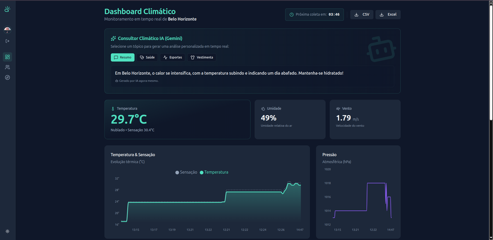

# 🌦️ GDASH - Weather Monitor Challenge

Solução completa para o desafio técnico GDASH. Um sistema de monitoramento climático distribuído, utilizando microsserviços, mensageria assíncrona, inteligência artificial generativa e visualização de dados em tempo real.

 

## 📺 Vídeo de Demonstração
[](https://youtu.be/Sm0yyEqfzwA)

## 🚀 Arquitetura da Solução

O sistema foi projetado seguindo o padrão de **Microsserviços** e **Event-Driven Architecture**:

1.  **Ingestão (Python):** Um serviço coletor que busca dados da **OpenWeather API** periodicamente (a cada 5 min) e publica em uma fila.
2.  **Mensageria (RabbitMQ):** Garante o desacoplamento e a persistência das mensagens entre o coletor e o processador.
3.  **Worker (Go):** Um consumidor de alta performance que lê a fila, valida os dados e os envia para a API.
4.  **Backend (NestJS):** API REST que gerencia regras de negócio, persistência (MongoDB), autenticação (JWT) e integração com IA (Gemini).
5.  **Frontend (React + Vite):** Dashboard interativo com gráficos em tempo real, autenticação e áreas de exploração.

#### Estrutura do projeto
```plaintext
desafio_gdash_2025_02/
├── docker-compose.yml           # O regente da orquestra
├── docker-compose.overrride.yml # Ambientes
├── .env                         # Variáveis globais
├── uploads/                     # Uploads das imagens do usuario
├── collector-weather/           # Serviço Python
├── worker-weather/              # Serviço Go
├── backend-api/                 # NestJS + TS & MongoDB
└── frontend/                    # React + Vite
```

---

## 🛠️ Tecnologias Utilizadas

* **Frontend:** React, Vite, TypeScript, TailwindCSS, shadcn/ui, Recharts, Axios.
* **Backend:** NestJS, Mongoose, Passport (JWT), Swagger.
* **Worker:** Go (Golang), AMQP.
* **Coletor:** Python, Pika, Requests.
* **Banco de Dados:** MongoDB.
* **Infraestrutura:** Docker & Docker Compose.
* **IA:** Google Gemini 1.5 Flash (Integração Sob Demanda).

---

## ✨ Funcionalidades Principais

### 1. Monitoramento Climático
* Coleta automática de dados meteorológicos.
* Dashboard com atualização em tempo real (Polling inteligente).
* Gráficos de tendência (Temperatura, Umidade, Vento e Pressão) das últimas horas.

### 2. Inteligência Artificial (Gemini)
* **Análise Sob Demanda:** O usuário pode solicitar insights específicos (Saúde, Esportes, Vestimenta) baseados nos dados climáticos atuais e históricos.
* **Otimização:** Uso do modelo `gemini-1.5-flash` para respostas rápidas e baixo custo.

### 3. Gestão de Dados
* **Exportação:** Download de relatórios históricos em **CSV** e **Excel (.xlsx)**.
* **Paginação:** Tabelas otimizadas com navegação no servidor.

### 4. Funcionalidades Extras
* **Autenticação Robusta:** Login e Registro com JWT e hash de senha (Bcrypt).
* **Pokédex Explorer (BFF):** Módulo bônus que consome a PokéAPI via Backend for Frontend, com busca dinâmica e "Radar Climático" (sugere Pokémons baseados no clima de uma cidade).
* **Gamificação:** Roleta de captura de Pokémons integrada ao perfil do usuário.

---

## ⚙️ Como Rodar o Projeto

### Pré-requisitos
* Docker e Docker Compose instalados.

### Passo a Passo

1.  **Clone o repositório:**
    ```bash
    git clone [https://github.com/PHdaCruzSantos/desafio-gdash-2025-02.git](https://github.com/PHdaCruzSantos/desafio-gdash-2025-02.git)
    cd desafio-gdash-2025-02
    ```

2.  **Configure as Variáveis de Ambiente:**
    Crie um arquivo `.env` na raiz do projeto com o seguinte conteúdo:

    ```ini
    # --- Banco de Dados ---
    MONGO_USER=admin
    MONGO_PASSWORD=password
    MONGO_DB=weather_logs
    MONGO_PORT=27017
    
    # --- RabbitMQ ---
    RABBITMQ_USER=user
    RABBITMQ_PASS=password
    RABBITMQ_PORT=5672
    RABBITMQ_UI_PORT=15672
    
    # Obtenha sua chave em: [https://openweathermap.org/api](https://openweathermap.org/api)
    OPENWEATHER_API_KEY=sua_chave_openweather_aqui
    
    # Obtenha sua chave em: [https://aistudio.google.com/](https://aistudio.google.com/)
    GEMINI_API_KEY=sua_chave_gemini_aqui
    
    WEATHER_CITY=Belo Horizonte
    WEATHER_LAT=-19.9167
    WEATHER_LON=-43.9345
    WEATHER_CHECK_INTERVAL=300
    JWT_SECRET=segredo_super_seguro_para_jwt
    ```

3.  **Execute com Docker Compose:**
    ```bash
    docker compose up -d --build
    ```

4.  **Acesse a Aplicação:**
    * **Frontend:** [http://localhost:5173](http://localhost:5173)
    * **API (Swagger):** [http://localhost:3000/weather/docs](http://localhost:3000/weather/docs)
    * **RabbitMQ:** [http://localhost:15672](http://localhost:15672) (User: `user`, Pass: `password`)

5. **Usuário Padrão:**
    * **Email:** admin@gdash.com
    * **Senha:** 123456

---

## 🧪 Testando a Aplicação

1.  **Login:** Crie uma conta nova na tela de registro ou use as credenciais que você configurar.
2.  **Dashboard:** Aguarde alguns segundos para o Python coletar os primeiros dados e popular os gráficos.
3.  **IA:** No card "Consultor Climático", clique nos botões (Saúde, Esportes) para testar a integração com o Gemini.
4.  **Explorar:** Navegue na aba "Explorar" para testar a integração com a PokéAPI e o Autocomplete de cidades.

---

## 📂 Estrutura do Projeto

* `/backend-api`: API NestJS (Core do sistema).
* `/frontend`: SPA React com Vite e shadcn/ui.
* `/collector-weather`: Script Python para ingestão de dados.
* `/worker-weather`: Consumidor Go para processamento de fila.

---

## 🧠 Decisões Técnicas e Aprendizados

Durante o desenvolvimento, algumas decisões arquiteturais foram tomadas para garantir escalabilidade e manutenibilidade:

* **Padrão BFF (Backend for Frontend):** Para a integração com a PokéAPI, optei por centralizar as chamadas no NestJS. Isso protege a aplicação de mudanças na API externa e resolve problemas de CORS, além de permitir cache futuro.
* **Ingestão Resiliente (Python & Go):**
    * O coletor Python foi desenhado para ser *stateless* na conexão com o RabbitMQ, evitando timeouts em intervalos longos de coleta.
    * O Worker em Go utiliza *Structs* rígidas para garantir a integridade dos dados antes de chegarem à API.
* **IA Sob Demanda (Pull vs Push):** Mudei a arquitetura de IA de um modelo "Sempre Ativo" para "Sob Demanda". Isso reduziu o custo de tokens e a latência de gravação no banco de dados.

> 📘 **Quer saber mais?**
> Confira meu [Diário de Bordo Completo](./Diário%20de%20Bordo.md) onde documentei passo a passo os desafios técnicos (como o *Variable Shadowing* no Go) e a evolução do projeto.

Desenvolvido por **Pedro Henrique da Cruz Santos** para o Desafio [GDASH](https://gdash.io/).